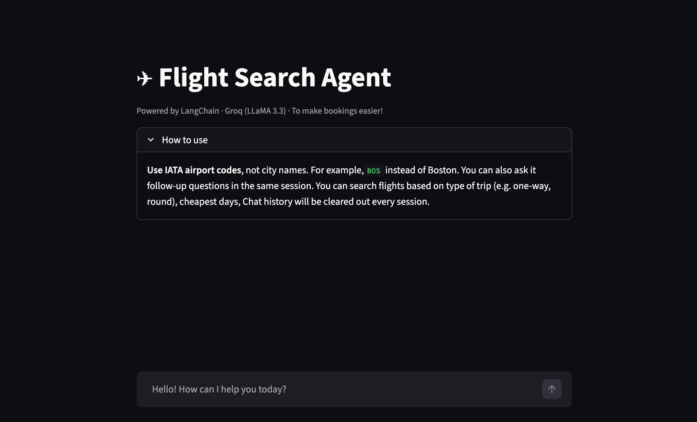
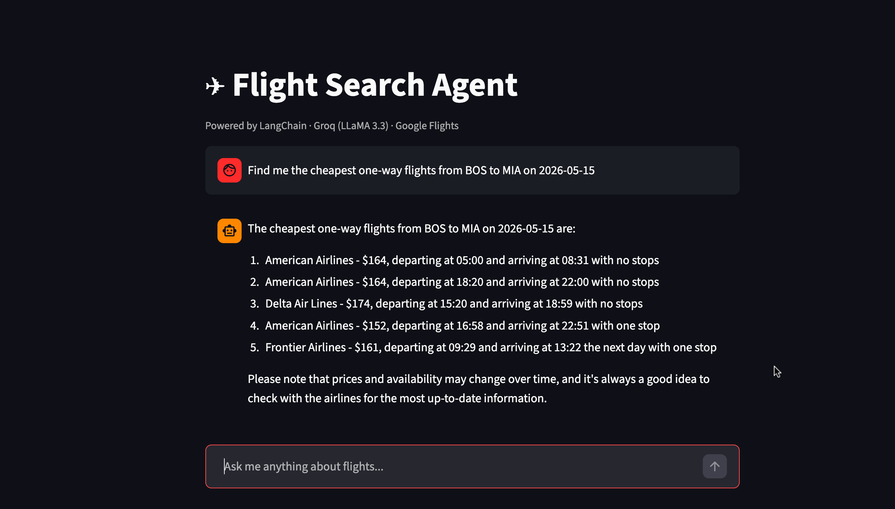
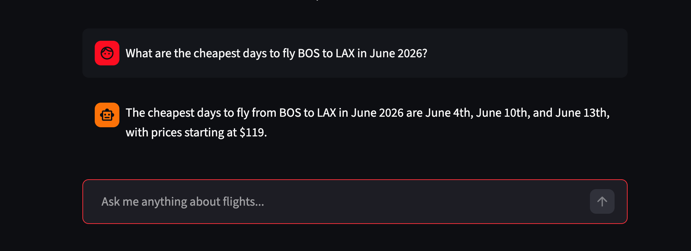

# FlightOps — AI Flight Search Agent

This is a conversational flight search agent powered by LLaMA 3.3, LangChain, and Google Flights data via SerpAPI. Ask in plain English - the agent picks the right tool, runs the search, and returns structured results. It's inspired to minimize effort in finding the most affordable flight tickets in today's era with a myriad of platforms available. While this is a prototype with free APIs used, it can be enhanced by replacing the models with higher versions of LLM models. 

---

## Demo




---

## Project Structure

```
flightOps/
├── agent.py          # LangChain agent - LLM + tool binding
├── app.py            # Streamlit 
├── tools.py          # Three LangChain tools wrapping SerpAPI
├── requirements.txt  # Dependencies
└── .env              
```

---

## Tools

| Tool | What it does |
|---|---|
| `search_flights` | Finds top 5 flights on a specific route and date |
| `find_cheapest_dates` | Scans a full month and returns the 3 cheapest days to fly |
| `compare_routes` | Ranks multiple origin-destination pairs by price |

The agent decides which tool to call based on the user's query. 

---

## Tech Stack

| Layer | Tool |
|---|---|
| LLM | LLaMA 3.3 70B via Groq |
| Agent Framework | LangChain `create_agent` |
| Flight Data | SerpAPI, a Google Flights engine |
| Frontend | Streamlit |
| Language | Python 3.12 |

---

## Setup

**1. Create and activate a virtual environment**
```bash
python3 -m venv .venv
source .venv/bin/activate
```

**2. Install dependencies**
```bash
pip install -r requirements.txt
```

**3. Add your API keys**

Create a `.env` file in the `flightOps/` directory:
```
GROQ_API_KEY=your_groq_key
SERPAPI_KEY=your_serpapi_key
```

Get your keys here:
- Groq: https://console.groq.com
- SerpAPI: https://serpapi.com/manage-api-key

**4. Run the app**
```bash
streamlit run app.py
```

---

## Usage Notes

- **IATA codes only** — use `BOS` not `Boston`, `JFK` not `New York`
- SerpAPI free tier gives **100 searches/month**. `find_cheapest_dates` uses ~10 searches per query, you can uprade to paid services if desired
- Supports one-way and round-trip searches

Inspired by: Krish Naik's LangChain tutorials