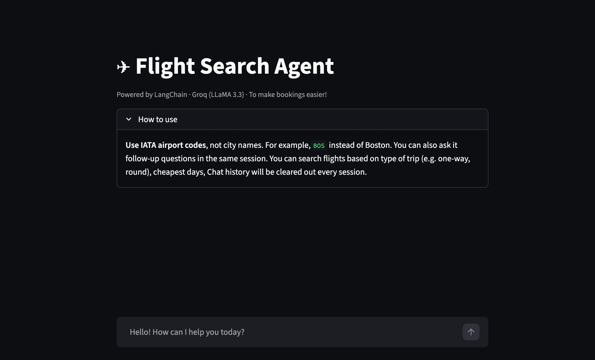
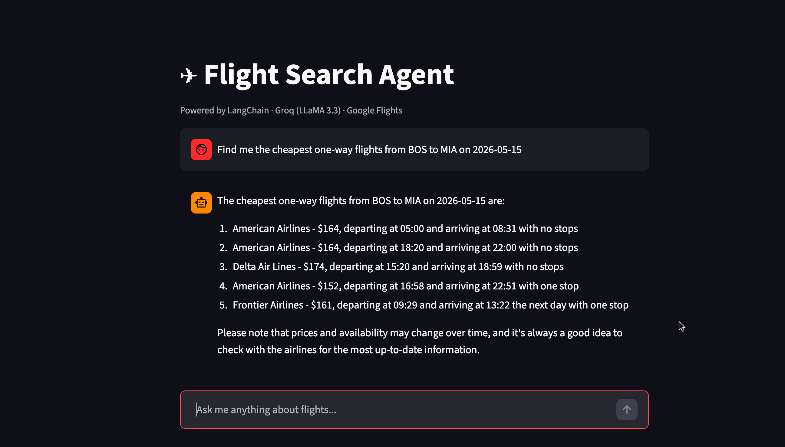
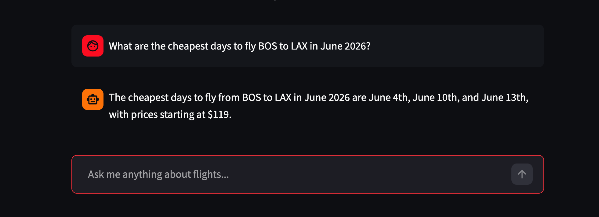

# FlightOps: Flight Search Agent

A chat agent that finds cheap flights. You ask in plain English, it decides which searches to run, calls Google Flights through SerpAPI, and comes back with ranked options. Built with LangChain tool calling on Groq's LLaMA 3.3 70B, wrapped in a Streamlit chat UI.

## Why an agent instead of a search form

A search form handles one question: this route, this date. But the questions people actually ask are messier. "What's the cheapest way to get to Miami in June" is really a scan across a whole month. "Should I fly out of Boston or New York" is a comparison across route combinations. An agent picks the right tool for the question, chains calls when it needs to, and handles follow ups in the same conversation.

## Project Structure

```
flightOps/
├── agent.py          # LangChain agent - LLM + tool binding
├── app.py            # Streamlit 
├── tools.py          # Three LangChain tools wrapping SerpAPI
├── requirements.txt  # Dependencies
└── .env              
```

## The three tools

**search_flights** is a straight route search. Origin, destination, date, one way or round trip. Returns the top 5 cheapest with airline, times, duration, and stops.

**find_cheapest_dates** scans a month for a route, checking every third day, and returns the 3 cheapest dates. This is the "I'm flexible, when should I fly" tool.

**compare_routes** takes multiple origins and destinations, prices every combination, and ranks them. "BOS,JFK" to "MIA,LAX" prices all four pairs in one go.

The LLM reads the docstrings and decides which tool fits the question. No routing logic written by hand.

## Decisions worth explaining

**Caching.** Every SerpAPI call costs money and takes seconds. Identical queries within a session hit an in memory cache instead of the API. The month scanner benefits most since it fires ten plus searches per question.

**Trimmed context.** Only the last 3 turns go to the model. Flight chat doesn't need memory of what you asked twenty minutes ago, and shorter context means faster, cheaper responses.

**Temperature 0.** A flight agent inventing an airline or a price is worse than useless. Zero temperature keeps the model boring, which is what you want when the output is prices.

**Groq over OpenAI.** Groq's inference is fast and the free tier is generous. A tool calling loop can make several LLM calls per user question, so latency adds up quickly.

## Running it

You need two free API keys: one from Groq (console.groq.com) and one from SerpAPI (serpapi.com).

Create a `.env` file:

## Demo




---

## Tools

| Tool | What it does |
|---|---|
| `search_flights` | Finds top 5 flights on a specific route and date |
| `find_cheapest_dates` | Scans a full month and returns the 3 cheapest days to fly |
| `compare_routes` | Ranks multiple origin-destination pairs by price |

The agent decides which tool to call based on the user's query. 

---

## Tech Stack

| Layer | Tool |
|---|---|
| LLM | LLaMA 3.3 70B via Groq |
| Agent Framework | LangChain `create_agent` |
| Flight Data | SerpAPI, a Google Flights engine |
| Frontend | Streamlit |
| Language | Python 3.12 |

---

## Setup

**1. Create and activate a virtual environment**
```bash
python3 -m venv .venv
source .venv/bin/activate
```

**2. Install dependencies**
```bash
pip install -r requirements.txt
```

**3. Add your API keys**

Create a `.env` file in the `flightOps/` directory:
```
GROQ_API_KEY=your_groq_key
SERPAPI_KEY=your_serpapi_key
```

Get your keys here:
- Groq: https://console.groq.com
- SerpAPI: https://serpapi.com/manage-api-key

**4. Run the app**
```bash
streamlit run app.py
```

---

## Usage Notes

- **IATA codes only** — use `BOS` not `Boston`, `JFK` not `New York`
- SerpAPI free tier gives **100 searches/month**. `find_cheapest_dates` uses ~10 searches per query, you can uprade to paid services if desired
- Supports one-way and round-trip searches

Inspired by: Krish Naik's LangChain tutorials
